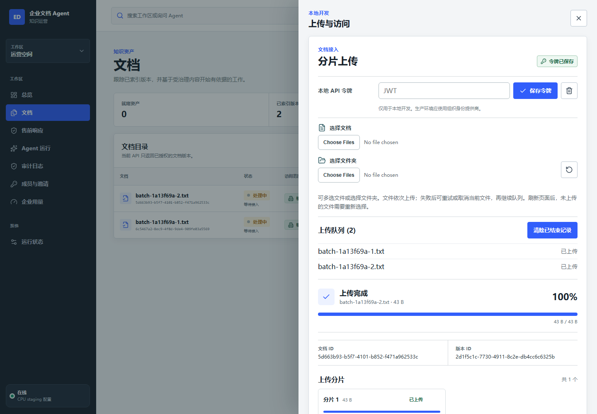
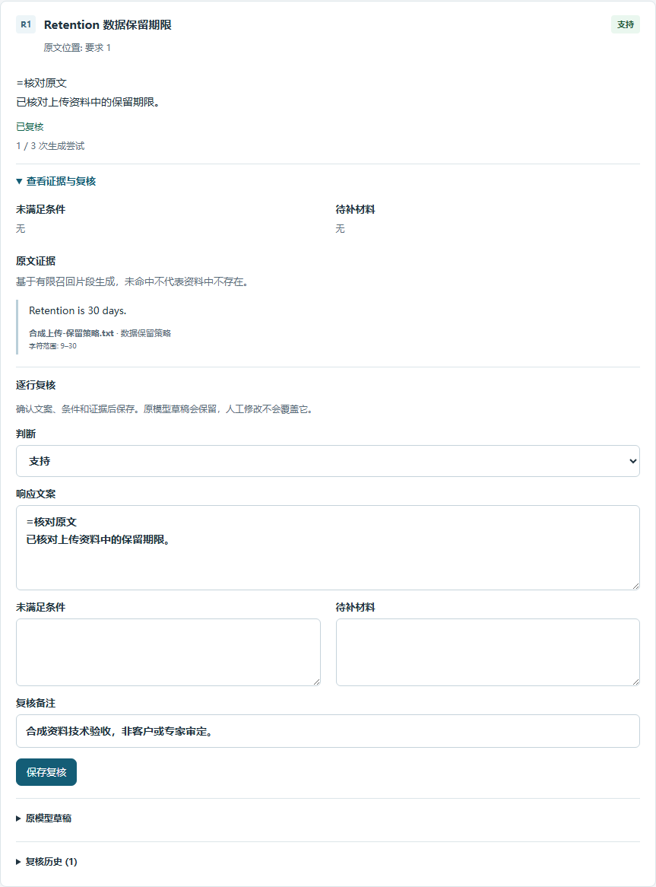
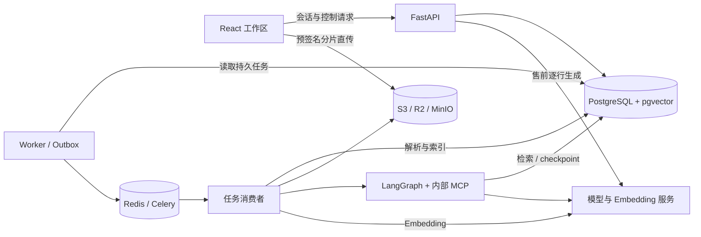

<div align="center">
  
  <h1>DocAgent · 企业文档 Agent</h1>
  <p><strong>把企业资料变成有出处、可复核、可交付的售前响应。</strong></p>
  <p>文档上传与检索 · 售前问卷 · Agent 工作流 · 人工复核 · 租户权限</p>

  <p>
    <a href="https://github.com/Drew-Z/enterprise-doc-agent/actions/workflows/quality.yml"></a>
    
    
    
    
  </p>

  <p>
    <a href="https://agent.playlab.eu.cc">试点站点</a> ·
    <a href="#quick-start">快速开始</a> ·
    <a href="#features">功能</a> ·
    <a href="#architecture">架构</a> ·
    <a href="#documentation">文档</a> ·
    <a href="https://github.com/Drew-Z/enterprise-doc-agent/issues">反馈问题</a>
  </p>
</div>

DocAgent 面向售前、安全问卷和企业知识核验场景。上传产品说明、制度或技术文档后，选择已就绪的资料建立响应表，逐条生成带原文引用的草稿，人工确认判断与措辞，再导出 CSV。需要多步处理时，可以使用带工具调用、执行记录和审批环节的 Agent 工作流。

**当前阶段：公开演示与受邀公网试点。** 2026-09-23 已部署 [v0.1.44](https://github.com/Drew-Z/enterprise-doc-agent/tree/v0.1.44)，可以免登录进入独立演示企业。正式企业使用 GitHub 登录，访问需要准入或邀请。当前采用 4 核 4 GB 单节点，数据库、对象存储和模型服务外置，适合低并发试用。

**公开演示已有完整公网流程验收。** v0.1.43 的验收覆盖两份 TXT 批量上传、解析、外部模型生成、六处原文引用核查、三条人工复核和已复核 CSV 导出；刷新恢复、手机布局、第二访客隔离及退出也已验证。v0.1.44 再次通过标准发布业务检查，原企业记录保留。详见[当前部署](https://github.com/Drew-Z/enterprise-doc-agent/actions/runs/35853410044)与[演示手册](docs/ops/public-pilot-runbook.md#公开演示企业)。

**引用转写已改为原文选择，复杂判断仍需人工复核。** v0.1.44 在新冻结的六题合成资料上得到 6 条有效草稿、11 处逐字正确引用，分类匹配 5/6，中位耗时约 65 秒，无重试。仍有一条漏掉采购与启用条件，另一条中文问题返回英文；单轮小样本不能代表客户准确率或速度改善。提供[原始结果、此前基线与问题说明](docs/ops/presales-quality-evaluation.md)。

**本分支 v7 为未部署候选。** 模型只接收本次引用编号与必要来源信息，展示条件由结构化前提统一生成。数据库和浏览器流程通过本地验证；另用新配置的 `grok-4.7` 渠道完成六次单次调用：三条有效草稿、两次超时、一次上游错误。三条草稿分类正确、六处引文准确，但其中一条仍把“验收状态未知”写成“未完成”，因此尚未达到发布门槛，后续18题未执行。见[新渠道结果与历史对照](docs/ops/presales-quality-evaluation.md#指定新渠道验证)。

此前 v4/v5 的分类、正文与前提问题，以及已撤回 v6 的引用和一致性失败，均保留在[历史评测记录](docs/ops/presales-quality-evaluation.md)。这些是助手编写合成资料的生成阶段试验，不代表公网端到端或真实客户准确率。

### 一键体验演示企业

打开[试点站点](https://agent.playlab.eu.cc/#/signin)，登录页同时提供“一键进入演示”和 GitHub 登录。每位访客自动获得独立的**演示企业**，资料、响应表、额度均归属该企业；同一浏览器刷新后可以继续，其他访客无法访问。

1. 点击“一键进入演示”，下载 [产品说明](apps/web/public/demo/product-guide.txt)、[交付说明](apps/web/public/demo/delivery-guide.txt)和[示例问卷](apps/web/public/demo/requirements.txt)。
2. 将两份资料一起上传，等待就绪；选择资料建立响应表，粘贴示例问卷。
3. 生成回应，展开原文证据、逐条保存复核，再导出 CSV。

演示企业有效期 2 小时，支持 6 个文件（单个 2 MiB、总计 10 MiB）、3 份响应表（每表最多 6 条要求）、6 次生成尝试，失败同样计数。退出或到期后无法继续访问，数据随后自动清理；请使用公开资料并及时导出结果。部署开关及全站预算见[公开演示手册](docs/ops/public-pilot-runbook.md#公开演示企业)。

## 界面预览



<details>
<summary>查看售前响应：原文证据、人工复核与历史草稿</summary>



</details>

截图来自真实浏览器的**本地集成验收**，使用合成资料与受控模型，展示实际产品界面；不包含客户文档，也不代表公网模型质量评测。

<a id="features"></a>
## 可以做什么

| 能力 | 当前实现 |
| --- | --- |
| 文档接入 | TXT、PDF、DOCX；多文件与文件夹选择；顺序上传队列；不支持或空文件给出跳过原因 |
| 上传恢复 | 分片直传对象存储、校验和、暂停与续传；刷新后先查询服务端状态，已完成会话不必重新选择文件 |
| 资料检索 | PostgreSQL 全文检索与 pgvector 向量召回，通过 RRF 合并；检索结果受租户与文档权限约束 |
| 售前响应 | 选择就绪文档、粘贴要求、逐条生成结构化草稿；查看出处、补充条件与待补材料；保留原草稿和复核历史；导出 CSV |
| 生成恢复 | 网络或代理报错后查询原响应状态；已保存的结果可恢复；不会自动重复提交模型请求 |
| Agent 执行 | 固定 LangGraph 流程、PostgreSQL checkpoint、内部 MCP 工具、SSE 事件恢复、人工审批与可验证产物 |
| 登录与协作 | GitHub OAuth 浏览器登录；应用会话与退出；企业准入、成员邀请、owner/member 权限、受限文档授权 |
| 公开演示企业 | 公网一键进入、每位访客独立企业、示例资料与真实业务流程；有期限与额度，自动清理；自行部署时默认关闭 |
| 用量与治理 | 企业试用周期与生成额度；用量记录；审计查询与 CSV 导出；保留策略、legal hold 与可验证归档 |
| 模型接入 | OpenAI-compatible Chat 与 Embedding 接口；Agent 主备路由与熔断；售前可独立选定路由和超时预算 |
| 交付与运维 | Docker 镜像、Kubernetes/K3s 清单、健康探针、GitHub Actions、镜像 digest、签名、SBOM 与发布证据 |

**典型操作路径**

1. GitHub 登录后接受准入或成员邀请，进入企业空间。
2. 上传资料，等待文档状态变为 **Ready / 就绪**。
3. 从文档创建售前响应表，录入需要逐条回应的要求。
4. 显式生成草稿，打开引用核对原文，再保存人工复核。
5. 导出草稿 CSV 或已复核 CSV，用于后续交付。

上传完成表示文件已收到，解析与索引仍可能继续。刷新页面后尚未上传的队列文件需要重新选择；文件夹路径只用于本地展示，不会创建服务端目录树。

<a id="quick-start"></a>
## 快速开始

### 先看界面

只需 Node.js 24 与 pnpm 11.9.0，在仓库根目录执行：

```powershell
pnpm install --frozen-lockfile
pnpm dev:web
```

打开 [本地只读演示](http://127.0.0.1:5173/?showcase=1#/overview)。页面会标注 `Showcase snapshot`，不需要数据库或模型服务，上传、生成、审批与下载等写操作不可用。

### 启动完整开发环境

前置依赖：**Python 3.12、uv 0.11.3、Node.js 24、pnpm 11.9.0、Docker 与 Compose v2**。以下命令使用 PowerShell，在仓库根目录执行。

安装锁定版本的依赖；首次配置时复制示例，保留已有 `.env`：

```powershell
uv sync --frozen
pnpm install --frozen-lockfile
if (-not (Test-Path -LiteralPath .env)) { Copy-Item .env.example .env }
docker compose -f infra/compose/docker-compose.yml config
uv run python scripts/foundation_smoke.py --preflight
```

启动 PostgreSQL/pgvector、Redis、MinIO，初始化对象桶和数据库：

```powershell
docker compose -f infra/compose/docker-compose.yml up -d --wait
docker compose -f infra/compose/docker-compose.yml --profile init run --rm minio-init
uv run alembic upgrade head
uv run enterprise-doc-checkpointer-setup --setup
uv run enterprise-doc-checkpointer-setup --check
```

分别在四个终端运行：

```powershell
# 终端 1：API
uv run enterprise-doc-api

# 终端 2：Worker 探针与 Outbox 发布
uv run enterprise-doc-worker

# 终端 3：任务消费者
uv run enterprise-doc-worker-consumer

# 终端 4：Web
pnpm dev:web
```

| 入口 | 地址 |
| --- | --- |
| Web 工作区 | [127.0.0.1:5173](http://127.0.0.1:5173) |
| API readiness | [127.0.0.1:8000/health/ready](http://127.0.0.1:8000/health/ready) |
| Worker readiness | [127.0.0.1:8081/health/ready](http://127.0.0.1:8081/health/ready) |
| API metrics | [127.0.0.1:8000/metrics](http://127.0.0.1:8000/metrics) |

这会启动开发服务，**不会自动创建可登录的试点企业或接通真实模型**。本地默认使用开发认证、确定性模型和 hash embedding；真实业务需要配置身份提供方、模型与 embedding，以及企业准入和额度。配置字段见 [环境示例](.env.example)、[浏览器认证契约](.trellis/spec/backend/browser-sessions.md)和[平台运营手册](docs/ops/platform-operations.md)。

也可以单独执行完整基础设施烟测：

```powershell
uv run python scripts/foundation_smoke.py --run
```

烟测会自行启动并检查依赖、迁移和应用端点，结束后停止其管理的进程与 Compose 服务，保留命名卷。应与手动启动模式分开使用。

停止手动开发环境的基础设施：

```powershell
docker compose -f infra/compose/docker-compose.yml down
```

<a id="architecture"></a>
## 架构



- **API 管控制与权限，文件直传对象存储。** 上传内容不需要经过 API 进程中转。
- **PostgreSQL 保存业务事实。** Job、Attempt、Outbox、文档版本、权限和执行状态持久化；Redis 用于任务投递与唤醒。
- **任务可恢复，结果有归属。** 租约、心跳和 fencing 约束重复执行；模型草稿与引用绑定到具体文档版本。
- **人工复核是独立记录。** 原始草稿与复核内容分别保留，模型输出不自动成为已复核结论。

| 目录 | 职责 |
| --- | --- |
| `apps/web` | React、TypeScript、Vite；文档、售前、Agent、成员、用量和审计工作区 |
| `apps/api` | FastAPI 路由、认证会话、请求与权限边界 |
| `apps/worker` | Outbox 发布、进程生命周期与探针 |
| `apps/mcp` | 内部 MCP stdio 协议与工具适配 |
| `packages/core` | 上传、入库、检索、Agent、售前、身份、权益与审计领域逻辑 |
| `infra` | 本地 Compose、容器镜像、Kubernetes overlays 与部署配置 |
| `scripts` / `tests` | 烟测、评估、发布校验、回归与集成验收 |
| `docs` / `evidence` | 操作手册、设计说明及带版本的验收证据 |

## 配置与部署

当前试点使用 **GitHub OAuth + 应用自身会话**，无需同机运行 Keycloak。代码还支持严格的 OIDC 校验；新增身份提供方需要单独验证协议、已验证邮箱声明和应用会话流程。

| 配置域 | 要点 |
| --- | --- |
| 身份 | GitHub OAuth App 使用准确的 `/auth/callback`；Client Secret 仅放服务端；登录后继续核验企业成员身份 |
| 存储 | PostgreSQL/pgvector 保存状态；S3-compatible 存储保存文档和产物；浏览器需要可达的预签名地址与匹配的 CORS |
| 模型 | 分别配置 Chat 与 Embedding；维度和索引版本必须一致；更换 embedding 需按手册重建索引 |
| 售前 | `PRESALES__GENERATION_ENABLED` 控制生成；`PRESALES__MODEL_ROUTE` 选择 `primary` 或 `fallback`；模型超时小于整行超时 |
| 演示 | `DEMO__ENABLED` 默认关闭；标准发布还要求启用浏览器会话及售前生成；无需新增常驻服务 |
| 运营 | 准入、邀请、试用期限与额度通过正式运营入口管理；凭据不放前端或版本库 |

`PRESALES__MODEL_ROUTE=fallback` 表示本次售前请求直接使用已配置的备用路由，并非先调用主模型失败后再自动调用一次。模型超时后，上游仍可能完成并计费；没有保存到应用的正文无法只凭供应商账单恢复，手动重试会发起新请求。

部署从 [4C4G 单节点手册](docs/ops/single-node-4c4g-staging-runbook.md)开始，使用已核验的镜像 digest 和配置清单。该 profile 将数据库、对象存储和推理外置，采用单副本及零 surge 更新；升级可能短暂中断服务。仓库还保留其他部署 overlay，不能把它们的资源预算当作当前主机配置。

发布链路：**Quality → Container Supply Chain → 镜像与配置核验 → staging 部署 → readiness 与业务验收**。签名、SBOM 和来源证明描述镜像构建与来源；它们不等于生产容量或模型效果保证。

## 开发与验证

```powershell
# 后端与前端基础质量检查
pnpm quality

# 单独运行前端检查
pnpm lint
pnpm typecheck
pnpm test
pnpm build

# 浏览器回归（先安装 Chromium）
pnpm --filter web exec playwright install chromium
pnpm --filter web test:e2e
```

基础 CI 与使用真实 PostgreSQL/Redis/对象存储的集成测试分别执行。浏览器、真实模型调用、外部部署和容量测试也有各自的环境要求；`pnpm quality` 不代替这些验收。

<details>
<summary>更多工程检查与历史里程碑</summary>

后端静态检查和非集成回归：

```powershell
uv run ruff format --check .
uv run ruff check .
uv run mypy packages/core/src apps/api/src apps/worker/src apps/mcp/src
uv run pytest -m "not integration"
```

断点续传、Agent 安全与模型路由的独立验证入口：

```powershell
uv run python scripts/multipart_smoke.py --preflight --size-bytes 1073741824 --interrupt-after-parts 2
uv run python scripts/evaluate_m4_agent.py
uv run python scripts/evaluate_m5.py
uv run python scripts/benchmark_m7.py --scenario deterministic --iterations 20
kubectl kustomize infra/k8s/overlays/single-node-4c4g
```

历史 **M1-M7** 分别覆盖上传、持久任务、检索、Agent、观测评估、交付部署和模型路由。证据中的提交、环境、日期和验收范围共同决定结论；本地或确定性结果不能当作公网模型质量、生产负载或灾备结果。

迁移回退 `uv run alembic downgrade base` 仅用于可丢弃的本地数据库往返验证，会撤销全部迁移；不是线上发布的常规步骤。恢复与回滚见部署手册。

</details>

<a id="documentation"></a>
## 文档导航

| 你想了解 | 入口 |
| --- | --- |
| 上传协议、恢复状态与批量队列 | [浏览器上传](.trellis/spec/frontend/browser-multipart-upload.md) · [服务端完成语义](.trellis/spec/backend/upload-completion.md) |
| 售前响应与复核行为 | [前端工作区](.trellis/spec/frontend/presales-workspace.md) · [后端契约](.trellis/spec/backend/presales-workspace.md) |
| 登录、准入与企业运营 | [浏览器会话](.trellis/spec/backend/browser-sessions.md) · [平台运营](docs/ops/platform-operations.md) |
| 公开演示企业与资源限制 | [演示契约](.trellis/spec/backend/public-demo.md) · [启用与回收](docs/ops/public-pilot-runbook.md#公开演示企业) |
| 当前主机部署与模型配置 | [4C4G 手册](docs/ops/single-node-4c4g-staging-runbook.md) · [真实 Embedding 上线](docs/ops/real-embedding-rollout.md) |
| 设计取舍与历史展示 | [项目说明](docs/showcase/PROJECT_SHOWCASE.md) · [UI 设计](docs/showcase/UI_REDESIGN_NOTES.md) · [企业化边界](docs/showcase/ENTERPRISE_READINESS.md) |
| 回归与发布执行记录 | [GitHub Actions](https://github.com/Drew-Z/enterprise-doc-agent/actions) · [版本标签](https://github.com/Drew-Z/enterprise-doc-agent/tags) · [证据目录](evidence) |

历史展示稿和验收报告保留各自的日期与版本；当前功能以源码、配置和对应部署记录为准。

## 当前边界与后续工作

- [x] 真实 GitHub 登录、企业空间与文档入库已在试点使用。
- [x] 多文件/文件夹队列、上传状态恢复、售前生成恢复与独立模型路由已实现并完成本地回归。
- [x] 独立演示企业、真实模型生成及已复核 CSV 导出完成本地和公网实测；第二访客隔离与刷新恢复通过。
- [x] 一键演示入口随 v0.1.43 上线，保留正式 GitHub 企业登录。
- [x] 公网完成两份 TXT 批量上传、三条响应生成、引用复核与 CSV 导出验收。
- [x] 六份复杂采购资料、五种判断状态完成两轮公网复测，公开原始结果、引用检查和失败记录。
- [x] 受控原文引用随 v0.1.44 上线；新冻结六题完成公网验证，公开误判、语言问题及用量。
- [ ] 修正采购与启用条件遗漏、输出语言问题；扩充独立审定与真实客户资料，改善生成时延并核实实际费用。
- [ ] 完成独立故障域恢复、外部监控告警及实际容量验收。

完整 SCIM/ABAC、外部内容连接器、公开远程 MCP 和 GPU/vLLM 部署尚未实现（not implemented）。现有受限 SCIM、文档 ACL、内部 MCP 与单节点 staging 各有明确范围。项目目前不承诺高可用、生产 QPS、WORM 合规或零停机升级。

## 反馈与贡献

欢迎通过 [GitHub Issues](https://github.com/Drew-Z/enterprise-doc-agent/issues)提供可复现的问题、使用场景或文档改进。提交问题时附上版本、操作步骤、错误码和请求编号；去除令牌、cookie 与真实企业文档正文。代码修改请附相关测试结果；新增能力同时更新对应文档。

**许可证：** 当前仓库尚未提供 `LICENSE` 文件，暂未声明开源使用授权；请勿将公开可读等同于 MIT 或 Apache 许可。
