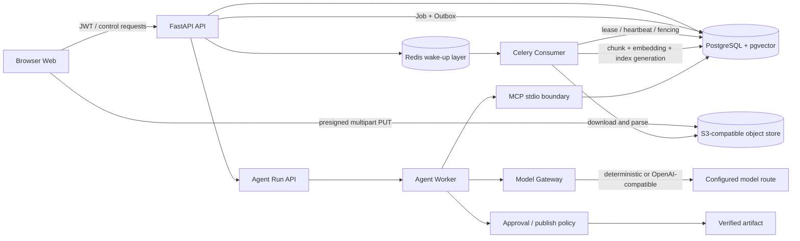

# 企业文档 Agent 平台

> 面向企业文档上传、检索、问答、审批与可审计发布的端到端 Agent 工程实践。

**项目性质**：独立工程实践 / 可运行的企业级架构样板

**当前展示边界**：CPU staging-capable、OpenAI-compatible 路由；不宣称生产容量、GPU/vLLM 或多故障域灾备已完成。
**适合阅读**：面试官、技术负责人、需要快速了解项目取舍的工程师。

## 一句话介绍

我设计并实现了一个企业文档 Agent 平台：浏览器将大文件分片直传对象存储，API 只负责控制面和权限，Worker 通过持久 Job、Transactional Outbox、租约和心跳完成可恢复入库；文档进入 PostgreSQL/pgvector 后，由固定 LangGraph 工作流通过 MCP 检索证据，生成带引用的答案，并在高风险场景进入人工审批和可审计发布。产品界面以 Overview、Documents、Agent runs、Audit log、Identity、Runtime 六个可分享页面承载这条业务链路，而不是停留在基础设施 smoke console。

## 它解决什么问题

普通的“上传文件后调用大模型”方案通常无法回答以下问题：

- 大文件上传中途断网或刷新页面后，如何继续而不重新上传？
- API、队列或 Worker 崩溃后，任务如何恢复，旧 Worker 如何避免覆盖新 Worker 的结果？
- 模型回答使用了哪些文档片段，引用是否属于当前租户授权范围？
- 高风险回答如何暂停等待人工审批，并保证审批、发布和下载都可审计？
- 发布、回滚、恢复和证据校验如何形成可复核的工程记录？

这个项目把重点放在可靠数据链路、权限边界和可恢复执行，而不是只做一个聊天页面。

## 总体架构

### 两条关键链路

**文档链路**

`创建上传会话 -> 预签名分片直传 -> complete/finalize -> Job + Outbox -> Consumer -> 解析与分块 -> embedding -> generation 激活 -> ready`

**Agent 链路**

`授权启动 run -> MCP search_document -> Hybrid Recall/RRF -> 证据冻结 -> grounded model request -> citation/grounding 校验 -> draft -> approval interrupt -> publish/artifact`

## 核心工程取舍

### 控制面与字节面分离

API 不接收 1 GiB 文件正文。浏览器通过受限的 presigned URL 直传对象存储，API 只保存会话、校验和状态。这降低 API 内存占用，也让上传恢复可以围绕对象存储的已上传分片进行 reconciliation。

### PostgreSQL 是事实源，Redis 只负责唤醒

Job、Attempt、Outbox、租户权限和 Agent 状态都落在 PostgreSQL。Redis/Celery 用于唤醒消费者，不承担唯一业务状态。这样可以在 Redis 暂时不可用时保留业务事实，并在 Outbox lease 到期后重新发布。

### lease、heartbeat、fencing 组合解决重复执行

Worker claim 任务后定期续租；旧 Worker 失联后，新的 Worker 可以在 lease 到期后接管。fencing token 让旧 Worker 即使恢复，也不能覆盖新一轮执行写入。

### Hybrid Recall 与显式拒答

关键词召回和向量召回通过 RRF 融合。Agent 只使用授权候选集中的冻结证据；证据不足、引用不合法或模型结构化输出不符合契约时，系统拒答或标记失败，而不是静默使用模型记忆。

### 固定图与人工审批

LangGraph 图把检索、生成、校验、审批和发布分成明确节点。高风险任务可以在 approval interrupt 暂停，审批接口具备幂等和目标校验，发布后生成可验证 artifact。

## 可展示功能

| 展示项 | 能说明什么 | 证据 |
| --- | --- | --- |
| 六页面产品工作区 | Overview、Documents、Agent runs、Audit log、Identity、Runtime 的正式信息架构、石墨色桌面侧栏、钴蓝操作强调色和移动抽屉 | [UI 改版说明](UI_REDESIGN_NOTES.md) |
| Documents inventory | 租户隔离的资产目录、版本/入库状态、生命周期筛选、搜索、上传入口和 Agent handoff | `GET /api/documents?limit=200`、`apps/web/src/product/DocumentsPage.tsx` |
| 受限文档授权 | Documents 策略抽屉管理 `tenant`/`restricted` 模式与用户/角色 grant；服务端实时撤销并统一保护 inventory/retrieval/Agent/artifact | `GET/PUT /api/documents/{id}/access`、`/grants`、`DocumentAccessDrawer.tsx`、`tests/security/test_document_acl_integration.py` |
| Answer review | 已验证答案、结构化字段、citation 摘录/页码、graph/prompt/tool 版本，以及同一 run 的模型、token、provider 请求、fallback 和 breaker 溯源 | `GET /api/agent-artifacts/{artifact_id}`、`GET /api/agent-runs/{run_id}`、`apps/web/src/agent/AgentWorkspace.tsx` |
| 平台 readiness 页面 | PostgreSQL、Redis、MinIO 依赖状态、服务端探针时间、运行概览，以及当前发布范围内“已验证 / 外部门槛 / 暂缓”的证据边界 | [dashboard-desktop-1440x900.png](../../evidence/m0/artifacts/dashboard-desktop-1440x900.png) |
| Agent run workspace | 任务类型、文档选择、运行事件、审批和 artifact 下载 | [agent-workspace-desktop-1440x900.png](../../evidence/m4/artifacts/agent-workspace-desktop-1440x900.png) |
| Audit log | 租户范围内按时间、action、资源和 actor 查询治理事件；游标加载历史、CSV 导出、owner-only retention/legal hold 控制面与 retention plan dry-run、桌面表格、移动卡片和资源 handoff | `GET /api/audit-events`、`GET /api/audit-events/export.csv`、`/api/audit-governance/*`、`apps/web/src/product/AuditPage.tsx`、`AuditGovernancePanel.tsx` |
| Identity administration | owner-only 成员 provisioning、角色调整、离职停用/恢复、最后 owner 保护、外部 issuer/subject binding 生命周期、可配置且冲突安全的 group/role 映射、受限 SCIM discovery/Users 分页过滤、串行 Bulk User 操作（含受限 PATCH）、user upsert/deprovision 与受限 `replace active/userName` PATCH、local JWT logout/revocation 和审计事件；结构化失败提示保留错误码与 request ID | `/api/members`、`/api/identity-bindings`、`/api/session/logout`、`/scim/v2/ServiceProviderConfig`、`/scim/v2/tenants/{tenantId}/Users`、`/scim/v2/tenants/{tenantId}/Bulk`、`MemberDirectoryPanel.tsx`、`IdentityPage.tsx`、`apps/web/src/api/errorDisplay.ts`、`tests/security/test_scim_provisioning_integration.py`、`test_session_revocation_integration.py` |
| 断点续传 | 分片上传暂停、刷新恢复、缺失分片 reconciliation | [upload-complete-1440x900.png](../../evidence/m1/screenshots/upload-complete-1440x900.png) |
| 移动端界面 | 工作区在窄屏下的基本可用性 | [agent-workspace-mobile-390x844.png](../../evidence/m4/artifacts/agent-workspace-mobile-390x844.png) |

## 无基础设施演示模式

当 API、数据库、Redis、MinIO 或模型服务尚未启动时，可以使用显式的本地只读快照完成产品演示：

`http://127.0.0.1:5173/?showcase=1#/overview`

该模式包含两个已入库文档版本、一个成功完成的 Agent run、可核对的引用摘录、已验证 artifact、执行元数据（模型版本、token 用量、provider 请求、fallback/breaker）、三项 runtime readiness 状态和发布范围证据边界。页面顶部和相关数据区会明确显示 `Showcase snapshot`；创建 run、上传、审批、取消和下载等写操作均禁用，不会发起 API 请求，也不应被表述为线上数据或真实生产状态。

可直接切换的展示路线：

- `?showcase=1#/overview`
- `?showcase=1#/documents`
- `?showcase=1#/agent-runs`
- `?showcase=1#/audit`
- `?showcase=1#/identity`
- `?showcase=1#/runtime`

## 当前可验证成果

- M0-M4、M8 的核心实现和相应证据已完成。
- 当前工作树非集成回归为 `989 passed`（`125` 项集成测试按标记单独执行）；前端为 `29` 个测试文件、`186 passed`；成员、外部绑定、live membership、受限 SCIM 和 local JWT revocation 五条 PostgreSQL 身份集成链路为 `7 passed`，完整 integration suite 为 `125 passed`，其余集成回归按环境单独执行。
- 前端 ESLint、TypeScript、Vite production build，以及后端 Ruff 定向检查和 `mypy packages/core/src apps/api/src` 均已通过。
- 六个产品页面已完成既有视觉检查；本轮 Identity 成员/绑定控制面另在桌面 `1440x1000` 和移动端 `390x844` 完成 Playwright 截图检查。
- 已有非 root 容器、Kubernetes base/staging/prod manifest、迁移 Job、探针、RBAC、NetworkPolicy、PDB 和发布/回滚脚本。
- 当前 4C4G 单节点 staging 路径已完成发布、迁移、工作负载 rollout、嵌入重建、readiness 检查和认证业务 smoke。
- M7 本地 deterministic routing 与 synthetic fallback contract 已有 20/20 重复验证。
- 文档 ACL 迁移已在本地 PostgreSQL 完成 upgrade/downgrade 往返；相关 Core、API、Worker、Agent、MCP 与安全回归为 `652 passed`。
- 文档 ACL 已补真实双用户浏览器证据：同租户 owner/member 通过真实 API、PostgreSQL 和 MinIO 完成上传、restricted、grant、撤销及刷新后不可见的完整链路。

## 必须主动说明的边界

以下内容不能在面试中说成已经完成生产验收：

- 真实 Provider 的可重复 40-case 质量 gate；
- 代表性业务容量和生产 QPS；
- managed observability、告警投递和事件响应闭环；
- 独立故障域的恢复演练及人工签字；
- GPU/vLLM/量化容量结果；
- 批量企业 IdP/SCIM 同步、首次登录自动 provisioning、上游离职同步、外部内容连接器和端到端 SSO 验收；当前服务端/Web 已具备 owner-only 的手工成员 provisioning/deprovisioning、角色与最后 owner 保护、有界成员搜索、显式 issuer/subject binding 生命周期、JWKS-backed OIDC token verification、可配置且冲突安全的 group/role 映射、受限 SCIM discovery、Users 分页/等值过滤与 50 操作串行 Bulk（含受限 PATCH）、user upsert/deprovision、仅支持 `replace active/userName` 的受限 PATCH、external principal adapter 契约及 active membership 复核，并为有效变更写入审计事件；认证失败另有不含凭据的结构化安全日志，成功 bearer 请求不冒充 login 事件。完整 SCIM PATCH 语义、bulkId 引用替换、复杂 filter、OAuth 授权服务器和真实 IdP 回调仍是外部 gate。
- 任意属性表达式、外部 PDP 等完整 ABAC 能力；
- 连接器级授权和跨文档 answer review 聚合体验。

Audit log 的 append-only 数据模型、租户查询、游标分页、CSV 导出、owner-only retention/legal hold 控制面、retention plan dry-run、可恢复 JSON archive snapshot、批次完整性验证、受控下载和前端治理时间线已经实现；归档执行不删除源事件，重复 fingerprint 幂等。没有真实租户数据时，`showcase=1` 只展示明确标注的本地只读快照，不应描述为线上审计记录。生产化仍需要 WORM/独立存储、跨区域复制、自动化恢复演练、删除证明、告警订阅和更细的管理员权限策略。

仓库的 2C/2GiB tiny 节点 profile 只适合 readiness 或隔离探针；当前 4C4G 单节点已足以完成受控 staging workflow，但没有备用节点，不能证明高可用、节点故障恢复、零停机升级或多故障域灾备。Swap 可以作为事故缓冲，但不能作为容量证据。

Figma 文件已经具备可编辑的界面参考，并通过连接的 Figma MCP Bridge 增加了 `ED / Design system handoff` 交付画板：其中记录了代码 token、可复用交互模式，以及 Overview、Documents、Agent runs、Audit log、Runtime health 五条产品路线。当前文件仍不是已发布的团队设计系统：没有本地变量、文字/效果样式或 Code Connect 映射。云端 library discovery 受到 Starter 访问/配额限制，Bridge 连接也是会话级的；在重新获得编辑权限并完成 metadata/screenshots 验证前，不把这份 handoff 夸大为正式组件库。React 实现和自动化测试仍是界面行为事实源。

## 面试中如何定位

推荐表述：

> 这是我独立设计并实现的企业文档 Agent 工程项目。我把面试中常见的“上传、RAG、Agent、审批、部署”拆成可恢复的业务链路，并用测试、证据 manifest 和 staging smoke 证明实现边界。对尚未具备外部条件的生产容量、GPU 和独立灾备，我保留了明确的 gate 和后续方案，没有把本地验证夸大成生产结论。

不推荐表述：

- “已经支持生产级 QPS”；
- “已经完成 GPU 推理和多地域容灾”；
- “所有真实模型质量指标都已通过”；
- “2C2G 节点可以承载完整生产工作流”。

## 相关入口

- [工程 README](../../README.md)
- [当前架构与配置缺口](../ops/current-architecture-and-config-gap.md)
- [企业化能力边界](ENTERPRISE_READINESS.md)
- [5 分钟面试演示脚本](INTERVIEW_DEMO_SCRIPT.md)
- [UI 改版说明与 Figma handoff](UI_REDESIGN_NOTES.md)

工作区中的配套面试材料：

- `D:/workspace4Cursor/offer/output/企业文档Agent平台_正式项目展示稿.md`
- `D:/workspace4Cursor/offer/output/企业文档Agent平台_代码级内化手册.md`
- `D:/workspace4Cursor/offer/output/企业文档Agent平台_深度面试问答.md`
